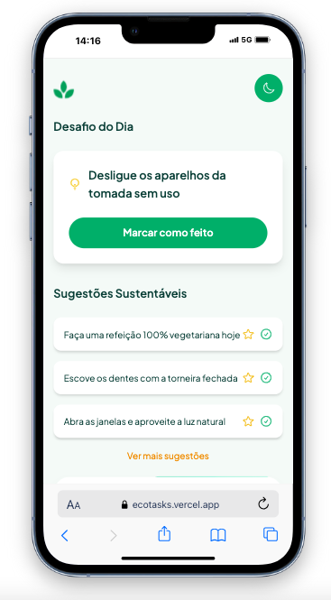

# 🌱 EcoTasks

Aplicativo de tarefas sustentáveis desenvolvido em React, Vite e Tailwind. O EcoTasks incentiva pequenas ações ecológicas diárias com uma experiência simples, moderna e interativa, incluindo sistema de favoritos, conclusão de tarefas e drag & drop.

[](https://opensource.org/licenses/MIT)
[](https://reactjs.org/)
[](https://ecotasks.vercel.app/)
[](https://github.com/juliabacchi1/ecotasks)



## 🚀 Tecnologias

- React
- Vite
- Tailwind CSS
- @dnd-kit – para funcionalidade de arrastar e soltar
- Heroicons – ícones modernos

## 📦 Instalação

```bash
git clone https://github.com/juliabacchi1/ecotasks.git
cd ecotasks
npm install
npm run dev
```

## 🔧 Funcionalidades

- ✅ Marcar sugestões sustentáveis como concluídas
- ⭐ Favoritar sugestões para destaque
- 📌 Organizar sugestões com drag & drop
- 📅 Desafio do dia em destaque
- 📉 Exibição da economia de CO₂ por tarefa
- 💾 Persistência local com localStorage

## 📁 Estrutura do projeto

```bash
src/
├── components/
│   ├── Challenge/
│   │   └── ChallengeCard.jsx
│   ├── Lists/
│   │   ├── SuggestionsSection.jsx
│   │   ├── SuggestionsSortable.jsx
│   │   └── SuggestionsItems.jsx
│   ├── Stats/
│   │   └── ImpactStats.jsx
├── data/
│   └── SuggestionsList.js
├── pages/
│   ├── AppShell/
│   │   └── AppShell.jsx
│   └── StyleGuide/
│       └── StyleGuide.jsx
├── App.jsx
└── main.jsx
```

## 🧪 Em desenvolvimento

- Tela de progresso semanal
- Integração com APIs de clima ou sustentabilidade
- Login e perfil de usuário

## 📄 Licença
MIT © Júlia Bacchi
